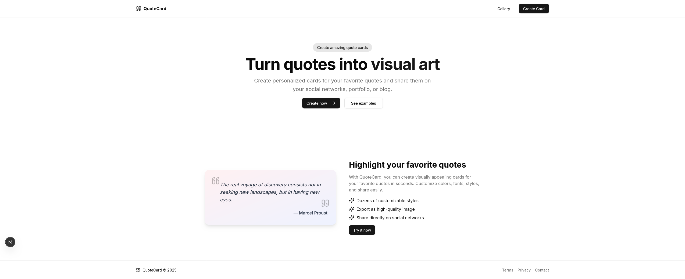
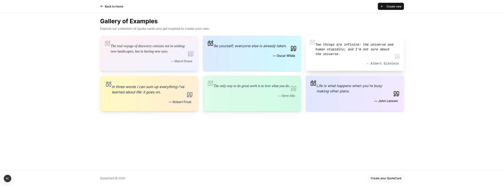
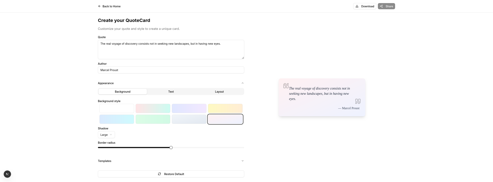

# Quote Card


> Transform words into visual inspiration! **Quote Card** was born from the desire to eternalize remarkable phrases, powerful thoughts, and motivational messages in elegant and shareable digital cards. Imagine being able to create, customize, and collect quotes that inspire you — or inspire the world with your own words. With an intuitive interface and creative features, Quote Card is the perfect space to bring your creativity to life and spread positivity.

## 💻 Demo


<p align="center"><i>Find instant inspiration: browse impactful quotes.</i></p>


<p align="center"><i>Explore an exclusive gallery: quickly access ready-to-share cards and stand out.</i></p>


<p align="center"><i>Create your own card: turn your ideas into unique visual pieces and win your audience.</i></p>

## ⚠️ Prerequisites

- Node 23.9.0+

## 🚀 Running the project

```bash
# Clone the repository
$ git clone https://github.com/ImGabreuw/quote-card.git

# Enter the project directory
$ cd quote-card

# Install dependencies
$ npm i

# Run the application
$ npm run dev
```

Access http://localhost:3000/

## 📫 Contribution

To contribute to **quote-card**, follow these steps:

1. Fork this repository.
2. Create a branch: `git checkout -b <feature-name>`.
3. Make your changes and commit them: `git commit -m '<short description of the feature>'`
4. Push to the original branch: `git push origin <feature/feature-name>`
5. Create the pull request.

Alternatively, check out GitHub's documentation on [how to create a pull request](https://help.github.com/en/github/collaborating-with-issues-and-pull-requests/creating-a-pull-request).

## 🤝 Contributors

We thank the following people who contributed to this project:

<table>
  <tr>
    <td align="center">
      <a href="https://github.com/ImGabreuw">
        <br>
        <sub>
          <b>ImGabreuw</b>
        </sub>
      </a>
    </td>
  </tr>
</table>

[⬆ Back to top](#quote-card)<br>